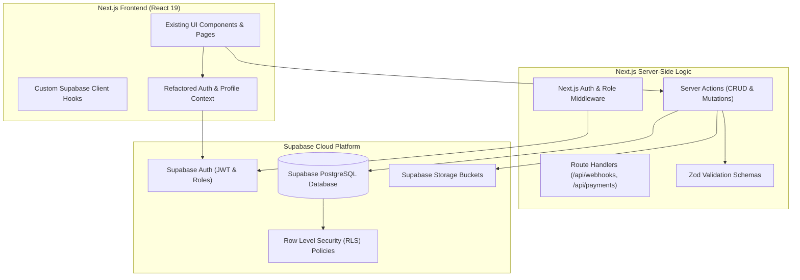

# Comprehensive Codebase Audit & Backend Integration Proposal
**Project:** PGFinder (Student PG Accommodation Platform)  
**Live Application:** [https://pg-finder-pccoe.vercel.app/](https://pg-finder-pccoe.vercel.app/)  
**Audit Date:** September 2026  
**Auditor:** Senior Full-Stack Architect (Antigravity)

---

## Executive Summary

PGFinder is a modern, visually rich Next.js web application designed to help university students discover, compare, and book verified, broker-free Paying Guest (PG) accommodations near campus (specifically tailored around institutions like PCCOE, Pune).

The frontend demonstrates exceptional visual polish with bespoke UI tokens, fluid WebGL backgrounds (`three.js` / `@react-three/fiber`), Lenis smooth scrolling, GSAP page transitions, and responsive multi-persona views for **Guests**, **Students**, **Owners**, and **Admins**.

However, the current codebase operates **100% on client-side state and mock data**, managed through an in-memory React Context (`PersonaContext.tsx`) persisted partially to browser `localStorage`. There are **no backend database integrations, no server-side authentication, no real file storage, no API routes, and no server-side security checks**. 

This document delivers a complete forensic audit of the existing codebase across 25 architectural dimensions, catalogs every location of hardcoded mock data, and outlines an end-to-end production backend architecture utilizing **Supabase (PostgreSQL, Auth, Storage, Row Level Security)**, **Next.js Server Actions & Route Handlers**, **TypeScript**, and **Zod Validation**.

---

## 1. Framework & Core Version Analysis

| Package / Tool | Version | Status / Notes |
| :--- | :--- | :--- |
| **Next.js** | `16.3.0` | Latest App Router architecture; uses `react@19` Canary/RC compatibility |
| **React / React-DOM** | `19.2.8` | Next-generation React with Actions, Transitions, and `use()` hook |
| **TypeScript** | `^5` | Strict mode enabled in [tsconfig.json](file:///c:/PG%20finder/tsconfig.json) (`strict: true`, target `ES2017`) |
| **TailwindCSS** | `^4` (`@tailwindcss/postcss`) | CSS-first configuration via `@theme` directive in [globals.css](file:///c:/PG%20finder/src/app/globals.css) |
| **Three.js / Fiber / Drei** | `three: ^0.185.1`, `@react-three/fiber: ^9.7.0`, `@react-three/drei: ^10.7.8` | Canvas rendering for reactive liquid fluid shader background |
| **GSAP & React GSAP** | `gsap: ^3.15.0`, `@gsap/react: ^2.1.2` | Page wipe transitions in `template.tsx`, magnetic buttons, preloader |
| **Lenis Scroll** | `lenis: ^1.3.26`, `@studio-freight/lenis: ^1.0.42` | Smooth momentum scrolling wrapper |
| **Framer Motion** | `^13.1.0` | Installed in dependencies (available for micro-interactions) |
| **ESLint** | `^9` (`eslint-config-next: 16.3.0`) | Flat config format in [eslint.config.mjs](file:///c:/PG%20finder/eslint.config.mjs) |

---

## 2. Project Directory Structure

```
c:\PG finder
├── .git/
├── .gitignore
├── .next/
├── AGENTS.md
├── CLAUDE.md
├── README.md
├── eslint.config.mjs
├── next-env.d.ts
├── next.config.ts
├── package.json
├── package-lock.json
├── postcss.config.mjs
├── public/
│   ├── file.svg, globe.svg, next.svg, vercel.svg, window.svg
│   └── team/                         # Founder & leadership team headshots
│       ├── amey-jadhav.png
│       ├── atharva-shinde.png
│       ├── ayush-gawande.png
│       ├── makaranda-dharak.png
│       ├── masum-barsagade.png
│       └── rasika-patil.png
├── raw_screens/                      # 26 Static HTML UI prototype screens
├── src/
│   ├── app/                          # Next.js App Router root
│   │   ├── about/                    # About Us page & leadership team
│   │   ├── auth/                     # Student & Owner login/signup page
│   │   ├── contact/                  # Contact & support ticketing desk
│   │   ├── dashboard/                # Role-gated dashboard routes
│   │   │   ├── admin/                # Admin portal
│   │   │   │   ├── reports/          # Flagged content & abuse reports
│   │   │   │   ├── verification/     # Document & safety audit pipeline
│   │   │   │   ├── layout.tsx        # Admin sidebar layout & role guard
│   │   │   │   └── page.tsx          # Admin KPI & metrics overview
│   │   │   ├── owner/                # Property Owner portal
│   │   │   │   ├── calendar/         # Monthly tour calendar & slot management
│   │   │   │   ├── listings/         # PG addition & property management
│   │   │   │   ├── meetings/         # Student visit request actions
│   │   │   │   ├── layout.tsx        # Owner sidebar layout & role guard
│   │   │   │   └── page.tsx          # Owner analytics, revenue & review stats
│   │   │   ├── student/              # Student portal
│   │   │   │   ├── reviews/          # Review writing & rating submission
│   │   │   │   ├── settings/         # Student profile & college ID verification
│   │   │   │   ├── shortlist/        # Saved/favorite properties
│   │   │   │   ├── layout.tsx        # Student sidebar layout & role guard
│   │   │   │   └── page.tsx          # Student scheduled tours & status
│   │   │   └── loading.tsx           # Dashboard fallback skeleton
│   │   ├── faq/                      # Categorized FAQ search & accordion
│   │   ├── listings/
│   │   │   └── [id]/                 # Dynamic PG details & booking page
│   │   │       ├── loading.tsx       # Detail page shimmer skeleton
│   │   │       └── page.tsx          # Room options, gallery, amenities, tour booking
│   │   ├── premium/                  # Monetization & student pass checkout flow
│   │   │   ├── checkout/             # Payment method selection (UPI/Card/NetBanking)
│   │   │   ├── confirm/              # Order review & billing summary
│   │   │   ├── history/              # Past student pass payment invoices
│   │   │   ├── processing/           # Simulated gateway transaction progress
│   │   │   ├── status/               # Payment failed / pending handler
│   │   │   ├── success/              # Payment confirmation & invoice download
│   │   │   └── page.tsx              # Pricing tier matrix (Monthly vs Yearly)
│   │   ├── pricing/                  # Alias redirect to /premium
│   │   ├── subscription/             # Alias redirect to /premium
│   │   ├── privacy/                  # Privacy policy page
│   │   ├── privacy-policy/           # Alias redirect to /privacy
│   │   ├── search/                   # Interactive search & filter catalogue
│   │   │   ├── loading.tsx           # Search results shimmer skeleton
│   │   │   └── page.tsx              # Search results, multi-filter sidebar
│   │   ├── terms/                    # Terms of service page
│   │   ├── terms-of-service/         # Alias redirect to /terms
│   │   ├── trust/                    # Trust & Safety standards pledge
│   │   ├── trust-and-safety/         # Alias redirect to /trust
│   │   ├── globals.css               # Design system tokens & utility classes
│   │   ├── layout.tsx                # Root layout with WebGL, smooth scroll & providers
│   │   ├── loading.tsx               # Global loading skeleton
│   │   ├── page.tsx                  # Landing homepage (Hero, Bento, Featured)
│   │   └── template.tsx              # GSAP route-change wipe animation
│   ├── components/
│   │   ├── AuthModal.tsx             # Simulated credential popup modal
│   │   ├── Footer.tsx                # Global footer with link categorizations
│   │   ├── Navbar.tsx                # Role switcher, responsive menu & nav links
│   │   ├── animations/
│   │   │   ├── CustomCursor.tsx      # Cursor listener component
│   │   │   ├── Magnetic.tsx          # GSAP quickTo physics button wrapper
│   │   │   ├── Preloader.tsx         # Brand wipe-up introductory screen
│   │   │   ├── SmoothScroll.tsx      # Lenis virtual scroll wrapper
│   │   │   ├── WebGLBackground.tsx   # Three.js interactive shader canvas
│   │   │   └── shaders.ts            # GLSL Simplex Noise vertex & fragment shaders
│   │   └── skeletons/
│   │       ├── DashboardSkeleton.tsx # Layout placeholder
│   │       ├── HomepageSkeleton.tsx  # Landing page shimmer
│   │       ├── ListingDetailsSkeleton.tsx # Room gallery shimmer
│   │       └── SearchSkeleton.tsx    # Filter and grid shimmer
│   └── context/
│       └── PersonaContext.tsx        # Central in-memory state & mock database
├── tsconfig.json
└── vercel.json
```

---

## 3. Routing Structure & Hierarchy

The application utilizes the Next.js App Router (`src/app`). All routes are statically or client-rendered.

```mermaid
graph TD
    Root["/ (Home Page)"] --> Search["/search"]
    Root --> Listing["/listings/[id]"]
    Root --> Auth["/auth"]
    Root --> About["/about"]
    Root --> Contact["/contact"]
    Root --> FAQ["/faq"]
    Root --> Trust["/trust (alias: /trust-and-safety)"]
    Root --> Privacy["/privacy (alias: /privacy-policy)"]
    Root --> Terms["/terms (alias: /terms-of-service)"]
    Root --> Premium["/premium (alias: /pricing, /subscription)"]
    
    Premium --> Checkout["/premium/checkout"]
    Premium --> Confirm["/premium/confirm"]
    Premium --> Processing["/premium/processing"]
    Premium --> Success["/premium/success"]
    Premium --> Status["/premium/status"]
    Premium --> History["/premium/history"]

    Root --> DashStudent["/dashboard/student"]
    DashStudent --> Shortlist["/dashboard/student/shortlist"]
    DashStudent --> Reviews["/dashboard/student/reviews"]
    DashStudent --> Settings["/dashboard/student/settings"]

    Root --> DashOwner["/dashboard/owner"]
    DashOwner --> OwnerListings["/dashboard/owner/listings"]
    DashOwner --> OwnerCalendar["/dashboard/owner/calendar"]
    DashOwner --> OwnerMeetings["/dashboard/owner/meetings"]

    Root --> DashAdmin["/dashboard/admin"]
    DashAdmin --> AdminVerification["/dashboard/admin/verification"]
    DashAdmin --> AdminReports["/dashboard/admin/reports"]
```



---

## 4. Component Inventory & Breakdown

1. **Global Frame Components**:
   - [Navbar.tsx](file:///c:/PG%20finder/src/components/Navbar.tsx): Sticky glassmorphic navbar, responsive drawer, persona role switcher dropdown (`GUEST`, `STUDENT`, `OWNER`, `ADMIN`), contextual navigation links.
   - [Footer.tsx](file:///c:/PG%20finder/src/components/Footer.tsx): 4-column structured footer with site links, copyright, and social badges.
   - [AuthModal.tsx](file:///c:/PG%20finder/src/components/AuthModal.tsx): Reusable modal dialog for role elevation and simulated 4-character login credentials.

2. **Visual & Animation Components**:
   - [WebGLBackground.tsx](file:///c:/PG%20finder/src/components/animations/WebGLBackground.tsx): Three.js `<Canvas>` running a custom GLSL fluid simulation responding to mouse position with lerp interpolation.
   - [shaders.ts](file:///c:/PG%20finder/src/components/animations/shaders.ts): 2D simplex noise algorithm creating soft organic green gradients.
   - [Preloader.tsx](file:///c:/PG%20finder/src/components/animations/Preloader.tsx): GSAP initial page load brand intro.
   - [Magnetic.tsx](file:///c:/PG%20finder/src/components/animations/Magnetic.tsx): High-frame-rate spring physics container for CTAs.
   - [SmoothScroll.tsx](file:///c:/PG%20finder/src/components/animations/SmoothScroll.tsx): Lenis integration for momentum scrolling.

3. **Loading Shimmers / Skeletons**:
   - [HomepageSkeleton.tsx](file:///c:/PG%20finder/src/components/skeletons/HomepageSkeleton.tsx)
   - [SearchSkeleton.tsx](file:///c:/PG%20finder/src/components/skeletons/SearchSkeleton.tsx)
   - [ListingDetailsSkeleton.tsx](file:///c:/PG%20finder/src/components/skeletons/ListingDetailsSkeleton.tsx)
   - [DashboardSkeleton.tsx](file:///c:/PG%20finder/src/components/skeletons/DashboardSkeleton.tsx)

---

## 5. Exhaustive Catalog of Hardcoded & Mock Data

The table below lists **every single location** across the codebase where hardcoded data, mock objects, or simulated delays exist:

| File Location | Line Numbers | Mock Data Item / Description |
| :--- | :--- | :--- |
| [src/context/PersonaContext.tsx](file:///c:/PG%20finder/src/context/PersonaContext.tsx#L94-L193) | L94–193 | `initialListings`: Array of 3 full PG properties (`listing-1`: Green Leaf Residences, `listing-2`: The Scholar's Abode, `listing-3`: Harmony House) with pricing, rooms, owner details, Unsplash/Google image URLs, amenities, and reviews. |
| [src/context/PersonaContext.tsx](file:///c:/PG%20finder/src/context/PersonaContext.tsx#L195-L222) | L195–222 | `initialBookings`: 2 mock tour appointments (`booking-1`, `booking-2`) for student "Aarav Malhotra". |
| [src/context/PersonaContext.tsx](file:///c:/PG%20finder/src/context/PersonaContext.tsx#L224-L243) | L224–243 | `initialVerificationPipeline`: 2 mock owner verification entries (`verify-1` for Harmony House, `verify-2` for Green Leaf Residences). |
| [src/context/PersonaContext.tsx](file:///c:/PG%20finder/src/context/PersonaContext.tsx#L245-L264) | L245–264 | `initialReports`: 2 mock flagged reports (`report-1` for offensive review, `report-2` for duplicate property). |
| [src/context/PersonaContext.tsx](file:///c:/PG%20finder/src/context/PersonaContext.tsx#L275) | L275 | Initial shortlist hardcoded to `['listing-2']`. |
| [src/app/search/page.tsx](file:///c:/PG%20finder/src/app/search/page.tsx#L21-L26) | L21–26 | `getMockDistance`: Mock regex/string matching converting "5 mins walk" to `0.5km`, "15 mins bus ride" to `3.0km`. |
| [src/app/listings/[id]/page.tsx](file:///c:/PG%20finder/src/app/listings/%5Bid%5D/page.tsx#L59-L61) | L59–61 | Hardcoded student profile injected on tour booking (`Aarav Malhotra`, `aarav@student.in`, `+91 98989 89898`). |
| [src/app/listings/[id]/page.tsx](file:///c:/PG%20finder/src/app/listings/%5Bid%5D/page.tsx#L289) | L289 | Mock Google Map iframe with hardcoded `srcDoc` HTML fallback instead of live Google Maps API embed. |
| [src/app/listings/[id]/page.tsx](file:///c:/PG%20finder/src/app/listings/%5Bid%5D/page.tsx#L250) | L250 | Hardcoded House Rules array (`['10PM Curfew', 'No Guests After 9PM', 'No Induction Cooking', 'Govt ID Proof Required']`). |
| [src/app/auth/page.tsx](file:///c:/PG%20finder/src/app/auth/page.tsx#L26-L35) | L26–35 | Simulated authentication via `setTimeout(..., 1200)` without database lookup or token verification. |
| [src/app/about/page.tsx](file:///c:/PG%20finder/src/app/about/page.tsx#L7-L12) | L7–12 | Hardcoded company metrics (`15,000+ Verified Beds`, `45+ Hubs`, `0₹ Brokerage`, `98.4% Rating`). |
| [src/app/about/page.tsx](file:///c:/PG%20finder/src/app/about/page.tsx#L41-L78) | L41–78 | Hardcoded founding team roster (Ayush Gawande, Makaranda Dharak, Rasika Patil, Masum Barsagade, Amey Jadhav, Atharva Shinde). |
| [src/app/contact/page.tsx](file:///c:/PG%20finder/src/app/contact/page.tsx#L15) | L15 | Mock ticket generator generating pseudo-random ticket IDs: `'SUP-' + Math.floor(100000 + Math.random() * 900000)`. |
| [src/app/contact/page.tsx](file:///c:/PG%20finder/src/app/contact/page.tsx#L19-L26) | L19–26 | Hardcoded PCCOE Pune campus address, phone number (`+91 20 6719 3300`), and email. |
| [src/app/faq/page.tsx](file:///c:/PG%20finder/src/app/faq/page.tsx#L17-L58) | L17–58 | 8 hardcoded FAQ question/answer objects across 4 categories. |
| [src/app/premium/page.tsx](file:///c:/PG%20finder/src/app/premium/page.tsx#L71-L150) | L71–150 | Hardcoded pricing tiers: Monthly ₹10 (30 days), Yearly ₹30 (365 days). |
| [src/app/premium/checkout/page.tsx](file:///c:/PG%20finder/src/app/premium/checkout/page.tsx#L20-L38) | L20–38 | Hardcoded mock card numbers (`4532 8920 1192 4892`), UPI IDs (`aarav.sharma@okaxis`), and promo codes (`CAMPUS10`, `FRESHER`). |
| [src/app/premium/processing/page.tsx](file:///c:/PG%20finder/src/app/premium/processing/page.tsx#L14-L39) | L14–39 | Mock payment countdown interval (6 seconds) with random Order ID generation (`PGF-ORD-XXXXXX`). |
| [src/app/premium/history/page.tsx](file:///c:/PG%20finder/src/app/premium/history/page.tsx) | Throughout | Mock invoice records and simulated PDF download handlers. |
| [src/app/dashboard/owner/page.tsx](file:///c:/PG%20finder/src/app/dashboard/owner/page.tsx#L37-L79) | L37–79 | Hardcoded monthly revenue (`₹56,500`), weekly traffic bar chart percentages (`40%` to `95%`), and owner persona name. |
| [src/app/dashboard/owner/listings/page.tsx](file:///c:/PG%20finder/src/app/dashboard/owner/listings/page.tsx#L48-L66) | L48–66 | Newly created listings use hardcoded fallback Unsplash URLs and hardcoded owner profile data. |
| [src/app/dashboard/owner/calendar/page.tsx](file:///c:/PG%20finder/src/app/dashboard/owner/calendar/page.tsx#L22-L30) | L22–30 | Hardcoded calendar array generating August 2026 dates (31 days). |
| [src/app/dashboard/admin/page.tsx](file:///c:/PG%20finder/src/app/dashboard/admin/page.tsx#L50-L64) | L50–64 | Hardcoded platform activity logs ("New property added", "Land Deeds document submitted", etc.). |
| [src/app/dashboard/student/settings/page.tsx](file:///c:/PG%20finder/src/app/dashboard/student/settings/page.tsx#L6-L10) | L6–10 | Hardcoded student state (`Aarav Malhotra`, `aarav@student.in`, `IIT Delhi`, `+91 98989 89898`). |
| [src/app/dashboard/student/reviews/page.tsx](file:///c:/PG%20finder/src/app/dashboard/student/reviews/page.tsx#L28) | L28 | Review author injected as hardcoded string "Aarav Malhotra". |
| [raw_screens/*.html](file:///c:/PG%20finder/raw_screens/) | All files | 26 static prototype screens with full static HTML/CSS representations. |

---

## 6. Functional & Feature Area Deep Dive

### 6.1 Authentication & Authorization
- **Current State**: Handled purely in `PersonaContext.tsx` and `AuthModal.tsx`.
- **Mechanism**: The user selects a role (`GUEST`, `STUDENT`, `OWNER`, `ADMIN`). On selection or login form submission, `localStorage.setItem('pgfinder_persona_role', role)` is set.
- **Security Vulnerability**: Any user can change their role to `ADMIN` by running `localStorage.setItem('pgfinder_persona_role', 'ADMIN')` in their browser console or picking "Admin" in the navbar dropdown. Route guards in `layout.tsx` check `if (role !== 'ADMIN')`, which offers zero real protection.

### 6.2 Existing API Routes & Database Integrations
- **API Routes**: `0` API routes exist (`src/app/api/` is non-existent).
- **Database**: `0` database connections. No ORM (Prisma/Drizzle), no direct SQL client, no Supabase SDK.
- **Environment Variables**: `0` environment variables configured (no `.env`, `.env.local`, or `process.env` references).

### 6.3 Search & Filtering
- **Implementation**: In [src/app/search/page.tsx](file:///c:/PG%20finder/src/app/search/page.tsx).
- **Filters**: Free-text location/title query, max distance slider (0.5km to 10km), max price slider (₹3,000 to ₹25,000), gender type checkboxes (`Boys`, `Girls`, `Co-ed`), sorting dropdown (`Recommended`, `Price: Low to High`, `Distance`, `Rating`).
- **Limitation**: Evaluated entirely in-memory using JavaScript `.filter()` over the 3-item `listings` state array.

### 6.4 Property / PG Detail Pages
- **Route**: [src/app/listings/[id]/page.tsx](file:///c:/PG%20finder/src/app/listings/%5Bid%5D/page.tsx).
- **Features**: Dynamic parameter extraction via `use(params)`, image thumbnail gallery switching, room options breakdown with availability badges, amenities checklist, owner contact triggers (`tel:` and `mailto:` links), student review list, and tour booking sidebar.
- **Missing**: SSR/SSG pre-fetching, dynamic OpenGraph meta tags, review submission on detail page, interactive Mapbox/Google Maps pin, real availability slot reservation.

### 6.5 Shortlist / Favorites
- **Implementation**: Array of string IDs in `PersonaContext.tsx` (`shortlist: string[]`).
- **Trigger**: Heart icon button on search cards and detail pages calling `toggleShortlist(id)`.
- **Limitation**: Does not persist per authenticated student account; resets on clearing browser state.

### 6.6 Visit Booking / Tour Scheduling
- **Implementation**: `addBooking()` in `PersonaContext.tsx`.
- **Fields**: `listingId`, `listingTitle`, `date`, `timeSlot`, `status`, `studentName`, `ownerName`.
- **Limitation**: No conflict prevention (e.g. double booking same hour), no email/SMS notification to the landlord, no calendar `.ics` invite generation.

### 6.7 Owner Dashboard
- **Location**: [src/app/dashboard/owner/](file:///c:/PG%20finder/src/app/dashboard/owner/).
- **Tabs**:
  - `Overview`: Static revenue and traffic graphs.
  - `My Listings`: Form allowing owners to append a new listing into local state.
  - `Tour Calendar`: Interactive grid showing bookings on dates for August 2026.
  - `Meeting Requests`: Action cards with "Approve Visit" and "Decline" buttons updating local booking status.
- **Limitation**: State updates do not reach other users or browsers; new listings disappear on page reload.

### 6.8 Admin Portal
- **Location**: [src/app/dashboard/admin/](file:///c:/PG%20finder/src/app/dashboard/admin/).
- **Tabs**:
  - `Overview`: Aggregated metrics (Total Listings, Verified PGs, Backlog, Reports).
  - `Verification Pipeline`: Pending owner document approvals. Approving an item sets `verified: true` on the matching listing title.
  - `Reports & Flags`: Open reports with "Dismiss Flag" and "Take Down / Resolve" handlers.

### 6.9 Image Handling & Assets
- **Standard `` Usage**: The application uses native `` elements throughout rather than Next.js `<Image />` (`next/image`).
- **Asset Sources**: Remote images loaded from Google CDN (`lh3.googleusercontent.com/aida-public/...`) and Unsplash (`images.unsplash.com/...`), alongside local team headshots in `/public/team/`.
- **Optimization Risk**: No automatic WebP conversion, responsive `srcset`, layout shift prevention (`blurDataURL`), or lazy loading optimizations provided by `next/image`.

### 6.10 Performance, SEO & Accessibility
- **Performance**:
  - Continuous animation loops in Three.js shader background (`WebGLBackground.tsx`) running at 60–120 FPS on all pages regardless of scroll position or battery saver settings.
  - Lenis smooth scroll and GSAP transition overlay (`Template.tsx`) running on every route transition.
- **SEO**:
  - Root metadata defined in `layout.tsx`.
  - Missing dynamic metadata in `/listings/[id]`, missing OpenGraph cards, Twitter cards, XML sitemaps, `robots.txt`, and Schema.org `RealEstateListing` JSON-LD.
- **Accessibility**:
  - Google Material Symbols loaded via external stylesheet with custom font variation settings. Some buttons lack explicit `aria-label`s.

---

## 7. Proposed Production Backend Integration Architecture

To transform PGFinder into an enterprise-grade, scalable, and secure accommodation platform without altering its UI design, we propose a backend architecture powered by **Supabase PostgreSQL**, **Supabase Auth**, **Supabase Storage**, **Next.js Server Actions & Route Handlers**, **TypeScript**, and **Zod Validation**.



---

### 7.1 Supabase PostgreSQL Database Schema Design

#### 1. `profiles` Table
Stores extended user profile data linked to Supabase `auth.users`.
```sql
CREATE TYPE user_role AS ENUM ('STUDENT', 'OWNER', 'ADMIN');

CREATE TABLE public.profiles (
  id UUID PRIMARY KEY REFERENCES auth.users(id) ON DELETE CASCADE,
  full_name TEXT NOT NULL,
  email TEXT NOT NULL UNIQUE,
  phone TEXT,
  role user_role NOT NULL DEFAULT 'STUDENT',
  avatar_url TEXT,
  college_name TEXT, -- Applicable for students
  student_id_doc_url TEXT, -- Verification file
  is_verified BOOLEAN DEFAULT FALSE,
  created_at TIMESTAMPTZ DEFAULT NOW(),
  updated_at TIMESTAMPTZ DEFAULT NOW()
);
```

#### 2. `pg_listings` Table
Core property listings table.
```sql
CREATE TYPE pg_gender_type AS ENUM ('Boys', 'Girls', 'Co-ed');

CREATE TABLE public.pg_listings (
  id UUID PRIMARY KEY DEFAULT gen_random_uuid(),
  owner_id UUID NOT NULL REFERENCES public.profiles(id) ON DELETE CASCADE,
  title TEXT NOT NULL,
  slug TEXT UNIQUE NOT NULL,
  description TEXT NOT NULL,
  location TEXT NOT NULL,
  city TEXT NOT NULL DEFAULT 'Pune',
  address TEXT NOT NULL,
  latitude DOUBLE PRECISION,
  longitude DOUBLE PRECISION,
  distance_text TEXT NOT NULL, -- e.g. "5 mins walk to PCCOE"
  distance_km NUMERIC(4,2) NOT NULL DEFAULT 1.0,
  base_price INTEGER NOT NULL, -- Starting monthly rent
  type pg_gender_type NOT NULL,
  is_premium BOOLEAN DEFAULT FALSE,
  is_verified BOOLEAN DEFAULT FALSE,
  house_rules TEXT[] DEFAULT '{}',
  created_at TIMESTAMPTZ DEFAULT NOW(),
  updated_at TIMESTAMPTZ DEFAULT NOW()
);
```

#### 3. `room_options` Table
Different room configurations per PG (Single, Double Sharing, Triple Sharing).
```sql
CREATE TABLE public.room_options (
  id UUID PRIMARY KEY DEFAULT gen_random_uuid(),
  listing_id UUID NOT NULL REFERENCES public.pg_listings(id) ON DELETE CASCADE,
  name TEXT NOT NULL, -- e.g. "Single Room", "Double Sharing"
  price INTEGER NOT NULL,
  total_beds INTEGER NOT NULL DEFAULT 1,
  available_beds INTEGER NOT NULL DEFAULT 1,
  is_available BOOLEAN DEFAULT TRUE,
  created_at TIMESTAMPTZ DEFAULT NOW()
);
```

#### 4. `amenities` & `listing_amenities` Tables
Normalized amenities catalogue.
```sql
CREATE TABLE public.amenities (
  id UUID PRIMARY KEY DEFAULT gen_random_uuid(),
  name TEXT UNIQUE NOT NULL, -- "Wifi", "AC", "Power Backup", "Food Included", "CCTV", "Gym", "Laundry"
  icon TEXT NOT NULL -- Material symbol icon name
);

CREATE TABLE public.listing_amenities (
  listing_id UUID REFERENCES public.pg_listings(id) ON DELETE CASCADE,
  amenity_id UUID REFERENCES public.amenities(id) ON DELETE CASCADE,
  PRIMARY KEY (listing_id, amenity_id)
);
```

#### 5. `listing_images` Table
Multiple high-resolution property photos with order sequence.
```sql
CREATE TABLE public.listing_images (
  id UUID PRIMARY KEY DEFAULT gen_random_uuid(),
  listing_id UUID NOT NULL REFERENCES public.pg_listings(id) ON DELETE CASCADE,
  image_url TEXT NOT NULL,
  display_order INTEGER DEFAULT 0,
  is_primary BOOLEAN DEFAULT FALSE,
  created_at TIMESTAMPTZ DEFAULT NOW()
);
```

#### 6. `bookings_visits` Table
Physical tour and scheduled visits between students and property owners.
```sql
CREATE TYPE booking_status AS ENUM ('Pending', 'Confirmed', 'Declined', 'Rescheduled', 'Completed', 'Cancelled');

CREATE TABLE public.bookings_visits (
  id UUID PRIMARY KEY DEFAULT gen_random_uuid(),
  listing_id UUID NOT NULL REFERENCES public.pg_listings(id) ON DELETE CASCADE,
  student_id UUID NOT NULL REFERENCES public.profiles(id) ON DELETE CASCADE,
  owner_id UUID NOT NULL REFERENCES public.profiles(id) ON DELETE CASCADE,
  visit_date DATE NOT NULL,
  time_slot TEXT NOT NULL, -- e.g. "Morning (10 AM - 12 PM)"
  status booking_status NOT NULL DEFAULT 'Pending',
  notes TEXT,
  created_at TIMESTAMPTZ DEFAULT NOW(),
  updated_at TIMESTAMPTZ DEFAULT NOW()
);
```

#### 7. `reviews` Table
Student reviews, ratings, and feedback.
```sql
CREATE TABLE public.reviews (
  id UUID PRIMARY KEY DEFAULT gen_random_uuid(),
  listing_id UUID NOT NULL REFERENCES public.pg_listings(id) ON DELETE CASCADE,
  student_id UUID NOT NULL REFERENCES public.profiles(id) ON DELETE CASCADE,
  rating NUMERIC(2,1) NOT NULL CHECK (rating >= 1.0 AND rating <= 5.0),
  comment TEXT NOT NULL,
  created_at TIMESTAMPTZ DEFAULT NOW(),
  updated_at TIMESTAMPTZ DEFAULT NOW(),
  UNIQUE(listing_id, student_id) -- One review per student per PG
);
```

#### 8. `shortlists` Table
Student favorites and shortlisted properties.
```sql
CREATE TABLE public.shortlists (
  student_id UUID REFERENCES public.profiles(id) ON DELETE CASCADE,
  listing_id UUID REFERENCES public.pg_listings(id) ON DELETE CASCADE,
  created_at TIMESTAMPTZ DEFAULT NOW(),
  PRIMARY KEY (student_id, listing_id)
);
```

#### 9. `verification_documents` Table
Owner compliance and land registry documents submitted for admin approval.
```sql
CREATE TYPE doc_status AS ENUM ('Pending', 'Approved', 'Rejected');

CREATE TABLE public.verification_documents (
  id UUID PRIMARY KEY DEFAULT gen_random_uuid(),
  listing_id UUID NOT NULL REFERENCES public.pg_listings(id) ON DELETE CASCADE,
  owner_id UUID NOT NULL REFERENCES public.profiles(id) ON DELETE CASCADE,
  document_type TEXT NOT NULL, -- "Land Deeds", "Fire NOC", "Aadhaar Card", "Utility Bill"
  document_name TEXT NOT NULL,
  file_url TEXT NOT NULL,
  status doc_status NOT NULL DEFAULT 'Pending',
  rejection_reason TEXT,
  reviewed_by UUID REFERENCES public.profiles(id),
  reviewed_at TIMESTAMPTZ,
  created_at TIMESTAMPTZ DEFAULT NOW()
);
```

#### 10. `reports_flags` Table
Abuse, offensive comments, and duplicate listing reports for moderation.
```sql
CREATE TYPE report_status AS ENUM ('Open', 'Resolved', 'Dismissed');
CREATE TYPE report_target AS ('Listing', 'Review', 'User');

CREATE TABLE public.reports_flags (
  id UUID PRIMARY KEY DEFAULT gen_random_uuid(),
  reporter_id UUID NOT NULL REFERENCES public.profiles(id) ON DELETE CASCADE,
  target_type report_target NOT NULL,
  target_id UUID NOT NULL,
  target_title TEXT NOT NULL,
  reason TEXT NOT NULL,
  status report_status NOT NULL DEFAULT 'Open',
  resolved_by UUID REFERENCES public.profiles(id),
  created_at TIMESTAMPTZ DEFAULT NOW(),
  updated_at TIMESTAMPTZ DEFAULT NOW()
);
```

#### 11. `premium_subscriptions` Table
Payment records, student pass activations, and transaction invoices.
```sql
CREATE TYPE subscription_tier AS ENUM ('Monthly', 'Yearly');
CREATE TYPE payment_status AS ENUM ('Pending', 'Success', 'Failed', 'Refunded');

CREATE TABLE public.premium_subscriptions (
  id UUID PRIMARY KEY DEFAULT gen_random_uuid(),
  user_id UUID NOT NULL REFERENCES public.profiles(id) ON DELETE CASCADE,
  tier subscription_tier NOT NULL,
  amount NUMERIC(6,2) NOT NULL,
  order_id TEXT UNIQUE NOT NULL,
  payment_method TEXT NOT NULL,
  status payment_status NOT NULL DEFAULT 'Pending',
  valid_from TIMESTAMPTZ,
  valid_until TIMESTAMPTZ,
  invoice_url TEXT,
  created_at TIMESTAMPTZ DEFAULT NOW()
);
```

---

### 7.2 Row Level Security (RLS) Policies

All tables will have Row Level Security enabled (`ALTER TABLE <table> ENABLE ROW LEVEL SECURITY;`).

```sql
-- Helper function to check if current authenticated user is an Admin
CREATE OR REPLACE FUNCTION public.is_admin()
RETURNS BOOLEAN AS $$
  SELECT EXISTS (
    SELECT 1 FROM public.profiles
    WHERE id = auth.uid() AND role = 'ADMIN'
  );
$$ LANGUAGE sql SECURITY DEFINER;

-- 1. Profiles RLS
ALTER TABLE public.profiles ENABLE ROW LEVEL SECURITY;
CREATE POLICY "Public profiles are readable by everyone" ON public.profiles
  FOR SELECT USING (true);
CREATE POLICY "Users can update their own profile" ON public.profiles
  FOR UPDATE USING (auth.uid() = id);

-- 2. PG Listings RLS
ALTER TABLE public.pg_listings ENABLE ROW LEVEL SECURITY;
CREATE POLICY "Anyone can view verified listings" ON public.pg_listings
  FOR SELECT USING (is_verified = TRUE OR auth.uid() = owner_id OR public.is_admin());
CREATE POLICY "Owners can create listings" ON public.pg_listings
  FOR INSERT WITH CHECK (auth.uid() = owner_id);
CREATE POLICY "Owners can update their own listings" ON public.pg_listings
  FOR UPDATE USING (auth.uid() = owner_id OR public.is_admin());
CREATE POLICY "Owners can delete their own listings" ON public.pg_listings
  FOR DELETE USING (auth.uid() = owner_id OR public.is_admin());

-- 3. Bookings / Visits RLS
ALTER TABLE public.bookings_visits ENABLE ROW LEVEL SECURITY;
CREATE POLICY "Students and Owners can view their own visits" ON public.bookings_visits
  FOR SELECT USING (auth.uid() = student_id OR auth.uid() = owner_id OR public.is_admin());
CREATE POLICY "Students can create visit requests" ON public.bookings_visits
  FOR INSERT WITH CHECK (auth.uid() = student_id);
CREATE POLICY "Participants can update visit status" ON public.bookings_visits
  FOR UPDATE USING (auth.uid() = student_id OR auth.uid() = owner_id OR public.is_admin());

-- 4. Shortlists RLS
ALTER TABLE public.shortlists ENABLE ROW LEVEL SECURITY;
CREATE POLICY "Students manage their own shortlist" ON public.shortlists
  FOR ALL USING (auth.uid() = student_id);

-- 5. Verification Documents RLS
ALTER TABLE public.verification_documents ENABLE ROW LEVEL SECURITY;
CREATE POLICY "Owners view own docs, Admins view all" ON public.verification_documents
  FOR SELECT USING (auth.uid() = owner_id OR public.is_admin());
CREATE POLICY "Owners can upload docs" ON public.verification_documents
  FOR INSERT WITH CHECK (auth.uid() = owner_id);
CREATE POLICY "Admins can update verification status" ON public.verification_documents
  FOR UPDATE USING (public.is_admin());
```

---

### 7.3 Supabase Storage Buckets & Policies

1. **`listing-photos`** (Public bucket)
   - Max file size: `5MB`
   - Allowed MIME types: `image/png`, `image/jpeg`, `image/webp`
   - Policy: Anyone can read; Authenticated owners can upload to their own folder (`owner_id/*`).
2. **`verification-documents`** (Private bucket)
   - Max file size: `10MB`
   - Allowed MIME types: `application/pdf`, `image/png`, `image/jpeg`
   - Policy: Accessible only by document owner (`auth.uid()`) and Admins.
3. **`user-avatars`** (Public bucket)
   - Max file size: `2MB`
   - Allowed MIME types: `image/png`, `image/jpeg`, `image/webp`
   - Policy: Anyone can read; Users can upload to `avatars/<user_id>`.

---

### 7.4 Zod Validation Schemas

All server action inputs will be strongly validated using Zod:

```typescript
import { z } from 'zod';

// PG Listing creation schema
export const CreateListingSchema = z.object({
  title: z.string().min(5, 'Title must be at least 5 characters').max(100),
  location: z.string().min(3, 'Location is required'),
  address: z.string().min(10, 'Full address is required'),
  distanceText: z.string().min(3, 'Distance description is required'),
  distanceKm: z.number().min(0.1).max(50),
  basePrice: z.number().int().min(1000, 'Minimum price is ₹1,000').max(100000),
  type: z.enum(['Boys', 'Girls', 'Co-ed']),
  description: z.string().min(20, 'Description must be at least 20 characters'),
  amenityIds: z.array(z.string().uuid()).min(1, 'Select at least one amenity'),
  rooms: z.array(
    z.object({
      name: z.string().min(2),
      price: z.number().int().positive(),
      totalBeds: z.number().int().positive(),
    })
  ).min(1, 'Provide at least one room configuration'),
});

// Visit Tour Booking schema
export const BookVisitSchema = z.object({
  listingId: z.string().uuid('Invalid property ID'),
  visitDate: z.string().refine((date) => new Date(date) >= new Date(), {
    message: 'Visit date must be today or in the future',
  }),
  timeSlot: z.enum([
    'Morning (10 AM - 12 PM)',
    'Afternoon (1 PM - 4 PM)',
    'Evening (5 PM - 7 PM)',
  ]),
  notes: z.string().max(300).optional(),
});

// Review Submission schema
export const CreateReviewSchema = z.object({
  listingId: z.string().uuid('Invalid property ID'),
  rating: z.number().min(1).max(5),
  comment: z.string().min(10, 'Review comment must be at least 10 characters').max(1000),
});
```

---

### 7.5 Next.js Server Architecture & Middleware

1. **Authentication Middleware (`middleware.ts`)**:
   - Inspects the Supabase session cookie (`@supabase/ssr`).
   - Restricts `/dashboard/student/*` to authenticated students.
   - Restricts `/dashboard/owner/*` to verified property owners.
   - Restricts `/dashboard/admin/*` to authorized system administrators.
   - Redirects unauthenticated users to `/auth?redirect=<path>`.

2. **Server Actions (`src/app/actions/`)**:
   - `listings.ts`: `fetchListings(filters)`, `getListingById(id)`, `createListing(data)`, `updateListing(id, data)`.
   - `bookings.ts`: `scheduleVisit(data)`, `updateVisitStatus(bookingId, status)`, `cancelVisit(bookingId)`.
   - `reviews.ts`: `submitReview(data)`, `deleteReview(reviewId)`.
   - `verification.ts`: `uploadVerificationDoc(formData)`, `reviewVerification(docId, status)`.
   - `shortlist.ts`: `toggleShortlist(listingId)`, `getStudentShortlist()`.

3. **Supabase Client Layer (`src/lib/supabase/`)**:
   - `server.ts`: Uses `@supabase/ssr` `createServerClient` with Next.js `cookies()` for Server Components & Actions.
   - `client.ts`: Uses `createBrowserClient` for client components requiring real-time subscriptions (e.g. live visit notification updates).

---

## 8. Step-by-Step Implementation Roadmap

| Phase | Milestone | Deliverables |
| :--- | :--- | :--- |
| **Phase 1** | Supabase Project Setup & Database Migration | Initialize Supabase project, execute SQL schema migration for all 11 tables, configure RLS security policies, and seed with realistic verified PG properties near PCCOE Pune. |
| **Phase 2** | Supabase Auth & Session Integration | Install `@supabase/supabase-js` & `@supabase/ssr`, replace simulated `PersonaContext` with real Supabase Auth, build Next.js session middleware, and configure role-based access tokens. |
| **Phase 3** | Server Actions & Dynamic Listings Integration | Replace static listings with PostgreSQL queries, implement full-text search and server-side filtering in `/search`, wire up dynamic `[id]` property detail pages with SSR. |
| **Phase 4** | Visit Booking, Shortlists & Review Engine | Implement real visit tour bookings with conflict detection, link shortlists to student accounts, and activate authentic rating calculation. |
| **Phase 5** | Storage, Owner Portal & Admin Verification | Setup Supabase Storage buckets for multi-image uploads, integrate owner property submission pipeline, and activate the real-time admin review & moderation board. |
| **Phase 6** | Production Optimization & SEO | Migrate `` tags to `next/image`, add dynamic OpenGraph/JSON-LD metadata, and configure Razorpay / Cashfree webhook integration for student premium pass processing. |

---

*End of Audit Report.*
