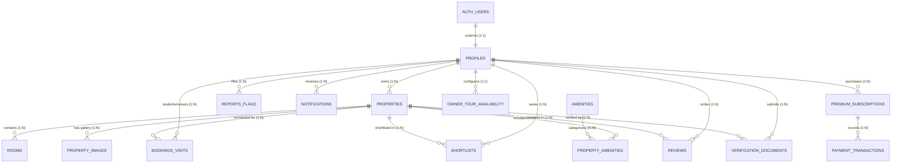

# Production Database Architecture Specification

**Project:** PGFinder (Student PG Accommodation Platform)  
**Database Engine:** Supabase PostgreSQL 15+  
**Architecture Phase:** Phase 1 (Production Database Architecture)  
**Author:** Senior Full-Stack & Database Architect  
**Status:** Approved Specification  

---

## 1. Executive Summary & Design Principles

The PGFinder database architecture is engineered to provide an enterprise-grade, high-concurrency, and secure data layer for student accommodation discovery, landlord property management, tour scheduling, safety verification, and platform moderation.

### Core Architectural Principles:
1. **Zero Client Trust & Role Defense**: The database strictly isolates privileged operations. Users **cannot** self-assign or escalate to `ADMIN` roles. Role transitions are guarded by database triggers and Row Level Security (RLS).
2. **Deterministic Entity Identity**: All entities utilize Universally Unique Identifiers (UUID v4) via `gen_random_uuid()` to prevent enumeration attacks and support distributed scaling.
3. **Strict Referential Integrity**: Foreign keys enforce cascade or restrict rules appropriate for auditability (e.g. deleting a property cascades to rooms and photos, while reviews and bookings preserve relational history or delete cleanly according to compliance).
4. **Automated Consistency via Triggers**: Average ratings, review counts, timestamps, and user profile bootstrapping are executed atomically at the database layer via PostgreSQL triggers.
5. **Row Level Security (RLS)**: 100% of public tables have RLS enabled with explicit least-privilege policies.
6. **Future Extensibility**: Subscription tiers, payment records, and invoice tracking are architected as native first-class schemas ready for Razorpay/Cashfree webhook activations in subsequent phases.

---

## 2. Entity Relationship Diagram (ERD)



---

## 3. Enumerated Types & Global Types

| Type Name | Allowed Values | Usage / Rationale |
| :--- | :--- | :--- |
| `user_role` | `'STUDENT'`, `'OWNER'`, `'ADMIN'` | Core platform persona identification |
| `property_gender_type` | `'Boys'`, `'Girls'`, `'Co-ed'` | Demographic categorization of accommodations |
| `booking_status` | `'Pending'`, `'Confirmed'`, `'Declined'`, `'Rescheduled'`, `'Completed'`, `'Cancelled'` | Lifecycle of student physical tour appointments |
| `verification_status` | `'Pending'`, `'Approved'`, `'Rejected'` | Admin document verification pipeline state |
| `report_target_type` | `'Property'`, `'Review'`, `'User'` | Polymorphic categorization of abuse reports |
| `report_status` | `'Open'`, `'Resolved'`, `'Dismissed'` | Moderation ticket lifecycle |
| `subscription_tier` | `'Monthly'`, `'Yearly'` | Student premium pass pricing tiers |
| `payment_status` | `'Pending'`, `'Success'`, `'Failed'`, `'Refunded'` | Transaction settlement lifecycle |
| `notification_type` | `'booking_request'`, `'booking_confirmed'`, `'booking_declined'`, `'verification_approved'`, `'verification_rejected'`, `'report_update'`, `'system_alert'` | In-app notification categorization |

---

## 4. Tables, Columns, Constraints & Relationships

### 4.1 `public.profiles`
Extends Supabase `auth.users`. Bootstrapped automatically via the `on_auth_user_created` trigger.

| Column | Data Type | Constraints | Default | Description |
| :--- | :--- | :--- | :--- | :--- |
| `id` | `UUID` | `PRIMARY KEY`, `REFERENCES auth.users(id) ON DELETE CASCADE` | — | Links directly to auth identity |
| `email` | `TEXT` | `NOT NULL`, `UNIQUE` | — | User email address |
| `full_name` | `TEXT` | `NOT NULL` | — | User's full legal / display name |
| `phone` | `TEXT` | — | `NULL` | Primary contact number |
| `role` | `user_role` | `NOT NULL` | `'STUDENT'` | Platform persona |
| `avatar_url` | `TEXT` | — | `NULL` | Remote or Supabase storage image URL |
| `college_name` | `TEXT` | — | `NULL` | Applicable for students (e.g. PCCOE, Pune) |
| `student_id_doc_url` | `TEXT` | — | `NULL` | Path to student college ID card file |
| `is_verified` | `BOOLEAN` | `NOT NULL` | `FALSE` | Identity verification state |
| `bio` | `TEXT` | — | `NULL` | Owner biography or student bio |
| `emergency_contact` | `TEXT` | — | `NULL` | Emergency contact information |
| `created_at` | `TIMESTAMPTZ` | `NOT NULL` | `timezone('utc'::text, now())` | Record creation timestamp |
| `updated_at` | `TIMESTAMPTZ` | `NOT NULL` | `timezone('utc'::text, now())` | Record update timestamp |

---

### 4.2 `public.properties`
The core PG accommodation entity.

| Column | Data Type | Constraints | Default | Description |
| :--- | :--- | :--- | :--- | :--- |
| `id` | `UUID` | `PRIMARY KEY` | `gen_random_uuid()` | Unique property ID |
| `owner_id` | `UUID` | `NOT NULL`, `REFERENCES public.profiles(id) ON DELETE RESTRICT` | — | Property owner profile ID |
| `title` | `TEXT` | `NOT NULL`, `CHECK (char_length(title) >= 3)` | — | Listing name (e.g. Green Leaf Residences) |
| `slug` | `TEXT` | `NOT NULL`, `UNIQUE` | — | URL-friendly unique slug |
| `description` | `TEXT` | `NOT NULL` | — | Detailed overview of property & living conditions |
| `location_name` | `TEXT` | `NOT NULL` | — | Human-readable neighborhood name (e.g. North Campus) |
| `city` | `TEXT` | `NOT NULL` | `'Pune'` | City of accommodation |
| `state` | `TEXT` | `NOT NULL` | `'Maharashtra'` | State |
| `pincode` | `VARCHAR(10)` | — | `NULL` | Postal code |
| `address` | `TEXT` | `NOT NULL` | — | Full physical address |
| `latitude` | `NUMERIC(10,7)`| `CHECK (latitude BETWEEN -90 AND 90)` | `NULL` | Geolocation latitude |
| `longitude` | `NUMERIC(10,7)`| `CHECK (longitude BETWEEN -180 AND 180)` | `NULL` | Geolocation longitude |
| `distance_text` | `TEXT` | `NOT NULL` | — | Proximity text (e.g. "5 mins walk to college") |
| `distance_km` | `NUMERIC(4,2)`| `NOT NULL`, `CHECK (distance_km >= 0)` | `1.0` | Exact distance in kilometers |
| `base_price` | `INTEGER` | `NOT NULL`, `CHECK (base_price >= 0)` | — | Starting monthly rent in INR |
| `gender_type` | `property_gender_type` | `NOT NULL` | — | 'Boys', 'Girls', or 'Co-ed' |
| `is_premium` | `BOOLEAN` | `NOT NULL` | `FALSE` | Featured / Student pass required |
| `is_verified` | `BOOLEAN` | `NOT NULL` | `FALSE` | Approved by platform administrators |
| `is_active` | `BOOLEAN` | `NOT NULL` | `TRUE` | Published and discoverable in search |
| `house_rules` | `TEXT[]` | `NOT NULL` | `'{}'` | Array of rules (e.g. '10PM Curfew') |
| `contact_phone` | `TEXT` | — | `NULL` | Direct contact phone for inquiries |
| `contact_email` | `TEXT` | — | `NULL` | Direct contact email for inquiries |
| `rating` | `NUMERIC(2,1)`| `NOT NULL`, `CHECK (rating >= 0.0 AND rating <= 5.0)` | `0.0` | Cached aggregate rating |
| `reviews_count` | `INTEGER` | `NOT NULL`, `CHECK (reviews_count >= 0)` | `0` | Cached total review count |
| `created_at` | `TIMESTAMPTZ` | `NOT NULL` | `timezone('utc'::text, now())` | Listing timestamp |
| `updated_at` | `TIMESTAMPTZ` | `NOT NULL` | `timezone('utc'::text, now())` | Modification timestamp |

---

### 4.3 `public.rooms`
Room configuration options per property (Single, Double Sharing, Triple Sharing, etc.).

| Column | Data Type | Constraints | Default | Description |
| :--- | :--- | :--- | :--- | :--- |
| `id` | `UUID` | `PRIMARY KEY` | `gen_random_uuid()` | Unique room configuration ID |
| `property_id` | `UUID` | `NOT NULL`, `REFERENCES public.properties(id) ON DELETE CASCADE` | — | Parent property ID |
| `name` | `TEXT` | `NOT NULL` | — | Room type name (e.g. 'Single Suite') |
| `price` | `INTEGER` | `NOT NULL`, `CHECK (price >= 0)` | — | Monthly rent in INR |
| `total_beds` | `INTEGER` | `NOT NULL`, `CHECK (total_beds >= 1)` | `1` | Total bed capacity |
| `available_beds` | `INTEGER` | `NOT NULL`, `CHECK (available_beds >= 0)` | `1` | Remaining vacant beds |
| `is_available` | `BOOLEAN` | `NOT NULL` | `TRUE` | Availability flag |
| `deposit_amount` | `INTEGER` | `CHECK (deposit_amount >= 0)` | `0` | Security deposit required in INR |
| `description` | `TEXT` | — | `NULL` | Room-specific details |
| `created_at` | `TIMESTAMPTZ` | `NOT NULL` | `timezone('utc'::text, now())` | Creation timestamp |
| `updated_at` | `TIMESTAMPTZ` | `NOT NULL` | `timezone('utc'::text, now())` | Update timestamp |

---

### 4.4 `public.property_images`
Photo gallery for accommodations.

| Column | Data Type | Constraints | Default | Description |
| :--- | :--- | :--- | :--- | :--- |
| `id` | `UUID` | `PRIMARY KEY` | `gen_random_uuid()` | Unique image ID |
| `property_id` | `UUID` | `NOT NULL`, `REFERENCES public.properties(id) ON DELETE CASCADE` | — | Parent property ID |
| `image_url` | `TEXT` | `NOT NULL` | — | Public URL or Supabase storage path |
| `caption` | `TEXT` | — | `NULL` | Optional image title / caption |
| `display_order` | `INTEGER` | `NOT NULL` | `0` | Sequence order in gallery carousel |
| `is_primary` | `BOOLEAN` | `NOT NULL` | `FALSE` | Main thumbnail flag |
| `created_at` | `TIMESTAMPTZ` | `NOT NULL` | `timezone('utc'::text, now())` | Upload timestamp |

---

### 4.5 `public.amenities` & `public.property_amenities`
Normalized amenities repository and join table.

#### `public.amenities`
| Column | Data Type | Constraints | Default | Description |
| :--- | :--- | :--- | :--- | :--- |
| `id` | `UUID` | `PRIMARY KEY` | `gen_random_uuid()` | Unique amenity ID |
| `name` | `TEXT` | `NOT NULL`, `UNIQUE` | — | Amenity name (e.g. Wifi, AC, Food Included) |
| `icon` | `TEXT` | `NOT NULL` | — | Material Symbol icon identifier |
| `category` | `TEXT` | `NOT NULL` | `'General'` | Grouping category (Comfort, Safety, Study) |
| `created_at` | `TIMESTAMPTZ` | `NOT NULL` | `timezone('utc'::text, now())` | Timestamp |

#### `public.property_amenities`
| Column | Data Type | Constraints | Description |
| :--- | :--- | :--- | :--- |
| `property_id` | `UUID` | `NOT NULL`, `REFERENCES public.properties(id) ON DELETE CASCADE` | Parent property |
| `amenity_id` | `UUID` | `NOT NULL`, `REFERENCES public.amenities(id) ON DELETE CASCADE` | Assigned amenity |
| `created_at` | `TIMESTAMPTZ` | `NOT NULL`, `DEFAULT timezone('utc'::text, now())` | Creation timestamp |
| **PRIMARY KEY** | `(property_id, amenity_id)` | — | Unique composite primary key |

---

### 4.6 `public.owner_tour_availability`
Landlord calendar settings, operating tour slots, and blackout dates.

| Column | Data Type | Constraints | Default | Description |
| :--- | :--- | :--- | :--- | :--- |
| `id` | `UUID` | `PRIMARY KEY` | `gen_random_uuid()` | Unique schedule ID |
| `owner_id` | `UUID` | `NOT NULL`, `REFERENCES public.profiles(id) ON DELETE CASCADE` | — | Owner profile |
| `property_id` | `UUID` | `REFERENCES public.properties(id) ON DELETE CASCADE` | `NULL` | Specific property (or all if NULL) |
| `morning_slot_open` | `BOOLEAN` | `NOT NULL` | `TRUE` | Morning Slot (10:00 AM - 12:00 PM) |
| `afternoon_slot_open`| `BOOLEAN` | `NOT NULL` | `TRUE` | Afternoon Slot (01:00 PM - 04:00 PM) |
| `evening_slot_open` | `BOOLEAN` | `NOT NULL` | `FALSE` | Evening Slot (05:00 PM - 07:00 PM) |
| `max_tours_per_day` | `INTEGER` | `NOT NULL`, `CHECK (max_tours_per_day >= 1)` | `5` | Maximum bookings allowed per date |
| `blackout_dates` | `DATE[]` | `NOT NULL` | `'{}'` | Explicit blocked calendar dates |
| `created_at` | `TIMESTAMPTZ` | `NOT NULL` | `timezone('utc'::text, now())` | Creation timestamp |
| `updated_at` | `TIMESTAMPTZ` | `NOT NULL` | `timezone('utc'::text, now())` | Update timestamp |

---

### 4.7 `public.bookings_visits`
Physical walkthrough tour bookings between students and landlords.

| Column | Data Type | Constraints | Default | Description |
| :--- | :--- | :--- | :--- | :--- |
| `id` | `UUID` | `PRIMARY KEY` | `gen_random_uuid()` | Unique booking ID |
| `property_id` | `UUID` | `NOT NULL`, `REFERENCES public.properties(id) ON DELETE CASCADE` | — | Target property |
| `student_id` | `UUID` | `NOT NULL`, `REFERENCES public.profiles(id) ON DELETE CASCADE` | — | Student requesting tour |
| `owner_id` | `UUID` | `NOT NULL`, `REFERENCES public.profiles(id) ON DELETE CASCADE` | — | Landlord hosting tour |
| `visit_date` | `DATE` | `NOT NULL` | — | Requested calendar date |
| `time_slot` | `TEXT` | `NOT NULL` | — | e.g. "Morning (10 AM - 12 PM)" |
| `status` | `booking_status` | `NOT NULL` | `'Pending'` | Lifecycle state |
| `notes` | `TEXT` | — | `NULL` | Student special instructions |
| `student_phone` | `TEXT` | — | `NULL` | Student contact number at time of booking |
| `cancellation_reason` | `TEXT` | — | `NULL` | Reason if declined or cancelled |
| `created_at` | `TIMESTAMPTZ` | `NOT NULL` | `timezone('utc'::text, now())` | Creation timestamp |
| `updated_at` | `TIMESTAMPTZ` | `NOT NULL` | `timezone('utc'::text, now())` | Update timestamp |

---

### 4.8 `public.shortlists`
Student bookmarked / favorite properties.

| Column | Data Type | Constraints | Description |
| :--- | :--- | :--- | :--- |
| `student_id` | `UUID` | `NOT NULL`, `REFERENCES public.profiles(id) ON DELETE CASCADE` | Student profile |
| `property_id` | `UUID` | `NOT NULL`, `REFERENCES public.properties(id) ON DELETE CASCADE` | Shortlisted property |
| `created_at` | `TIMESTAMPTZ` | `NOT NULL`, `DEFAULT timezone('utc'::text, now())` | Save timestamp |
| **PRIMARY KEY** | `(student_id, property_id)` | — | Enforces unique shortlist items |

---

### 4.9 `public.reviews`
Student ratings and feedback. Enforces one review per student per property.

| Column | Data Type | Constraints | Default | Description |
| :--- | :--- | :--- | :--- | :--- |
| `id` | `UUID` | `PRIMARY KEY` | `gen_random_uuid()` | Unique review ID |
| `property_id` | `UUID` | `NOT NULL`, `REFERENCES public.properties(id) ON DELETE CASCADE` | — | Target property |
| `student_id` | `UUID` | `NOT NULL`, `REFERENCES public.profiles(id) ON DELETE CASCADE` | — | Authoring student |
| `rating` | `NUMERIC(2,1)`| `NOT NULL`, `CHECK (rating >= 1.0 AND rating <= 5.0)` | — | Star rating (1.0 to 5.0) |
| `comment` | `TEXT` | `NOT NULL`, `CHECK (char_length(comment) >= 5)` | — | Written review content |
| `is_verified_resident` | `BOOLEAN` | `NOT NULL` | `FALSE` | Verified student stay badge |
| `created_at` | `TIMESTAMPTZ` | `NOT NULL` | `timezone('utc'::text, now())` | Creation timestamp |
| `updated_at` | `TIMESTAMPTZ` | `NOT NULL` | `timezone('utc'::text, now())` | Update timestamp |
| **CONSTRAINT** | `UNIQUE (property_id, student_id)` | — | — | One review per student per PG |

---

### 4.10 `public.verification_documents`
Landlord compliance and property registry audit pipeline.

| Column | Data Type | Constraints | Default | Description |
| :--- | :--- | :--- | :--- | :--- |
| `id` | `UUID` | `PRIMARY KEY` | `gen_random_uuid()` | Unique document record ID |
| `property_id` | `UUID` | `REFERENCES public.properties(id) ON DELETE CASCADE` | `NULL` | Associated property |
| `owner_id` | `UUID` | `NOT NULL`, `REFERENCES public.profiles(id) ON DELETE CASCADE` | — | Submitting owner |
| `document_type` | `TEXT` | `NOT NULL` | — | E.g. "Land Deeds", "Fire NOC", "Aadhaar" |
| `document_name` | `TEXT` | `NOT NULL` | — | Original file name |
| `file_url` | `TEXT` | `NOT NULL` | — | Supabase Storage path |
| `status` | `verification_status` | `NOT NULL` | `'Pending'` | Approval status |
| `rejection_reason` | `TEXT` | — | `NULL` | Feedback from reviewer |
| `reviewed_by` | `UUID` | `REFERENCES public.profiles(id) ON DELETE SET NULL` | `NULL` | Admin profile who audited doc |
| `reviewed_at` | `TIMESTAMPTZ` | — | `NULL` | Audit completion timestamp |
| `created_at` | `TIMESTAMPTZ` | `NOT NULL` | `timezone('utc'::text, now())` | Submission timestamp |
| `updated_at` | `TIMESTAMPTZ` | `NOT NULL` | `timezone('utc'::text, now())` | Update timestamp |

---

### 4.11 `public.reports_flags`
Abuse reporting, content moderation, and fraud flagging.

| Column | Data Type | Constraints | Default | Description |
| :--- | :--- | :--- | :--- | :--- |
| `id` | `UUID` | `PRIMARY KEY` | `gen_random_uuid()` | Unique report ID |
| `reporter_id` | `UUID` | `NOT NULL`, `REFERENCES public.profiles(id) ON DELETE CASCADE` | — | User who filed the report |
| `target_type` | `report_target_type` | `NOT NULL` | — | 'Property', 'Review', 'User' |
| `target_id` | `UUID` | `NOT NULL` | — | ID of the entity flagged |
| `target_name` | `TEXT` | `NOT NULL` | — | Human-readable title for admin grid |
| `reason` | `TEXT` | `NOT NULL` | — | Reason for report |
| `status` | `report_status` | `NOT NULL` | `'Open'` | 'Open', 'Resolved', 'Dismissed' |
| `admin_notes` | `TEXT` | — | `NULL` | Internal moderation notes |
| `resolved_by` | `UUID` | `REFERENCES public.profiles(id) ON DELETE SET NULL` | `NULL` | Admin who closed report |
| `resolved_at` | `TIMESTAMPTZ` | — | `NULL` | Resolution timestamp |
| `created_at` | `TIMESTAMPTZ` | `NOT NULL` | `timezone('utc'::text, now())` | Filing timestamp |
| `updated_at` | `TIMESTAMPTZ` | `NOT NULL` | `timezone('utc'::text, now())` | Update timestamp |

---

### 4.12 `public.support_tickets`
Customer support and helpdesk inquiries (from `/contact`).

| Column | Data Type | Constraints | Default | Description |
| :--- | :--- | :--- | :--- | :--- |
| `id` | `UUID` | `PRIMARY KEY` | `gen_random_uuid()` | Unique ticket ID |
| `ticket_number` | `TEXT` | `NOT NULL`, `UNIQUE` | — | Public ticket ID (e.g. SUP-892182) |
| `user_id` | `UUID` | `REFERENCES public.profiles(id) ON DELETE SET NULL` | `NULL` | Authenticated user (if logged in) |
| `full_name` | `TEXT` | `NOT NULL` | — | Submitter name |
| `email` | `TEXT` | `NOT NULL` | — | Submitter email address |
| `subject` | `TEXT` | `NOT NULL` | — | Category (e.g. 'student_inquiry') |
| `message` | `TEXT` | `NOT NULL` | — | In-depth ticket description |
| `status` | `TEXT` | `NOT NULL`, `CHECK (status IN ('Open', 'In Progress', 'Resolved', 'Closed'))` | `'Open'` | Ticket resolution state |
| `created_at` | `TIMESTAMPTZ` | `NOT NULL` | `timezone('utc'::text, now())` | Filing timestamp |
| `updated_at` | `TIMESTAMPTZ` | `NOT NULL` | `timezone('utc'::text, now())` | Update timestamp |

---

### 4.13 `public.notifications`
In-app notification feed for all user personas.

| Column | Data Type | Constraints | Default | Description |
| :--- | :--- | :--- | :--- | :--- |
| `id` | `UUID` | `PRIMARY KEY` | `gen_random_uuid()` | Unique notification ID |
| `user_id` | `UUID` | `NOT NULL`, `REFERENCES public.profiles(id) ON DELETE CASCADE` | — | Recipient user |
| `title` | `TEXT` | `NOT NULL` | — | Short alert headline |
| `message` | `TEXT` | `NOT NULL` | — | Notification body |
| `type` | `notification_type` | `NOT NULL` | `'system_alert'` | Category icon discriminator |
| `link_url` | `TEXT` | — | `NULL` | Internal route link (e.g. `/dashboard/owner/meetings`) |
| `is_read` | `BOOLEAN` | `NOT NULL` | `FALSE` | Read status |
| `created_at` | `TIMESTAMPTZ` | `NOT NULL` | `timezone('utc'::text, now())` | Broadcast timestamp |

---

### 4.14 `public.premium_subscriptions` (Future Monetization Ready)
Monetization records, student pass activations, and invoices.

| Column | Data Type | Constraints | Default | Description |
| :--- | :--- | :--- | :--- | :--- |
| `id` | `UUID` | `PRIMARY KEY` | `gen_random_uuid()` | Unique subscription ID |
| `user_id` | `UUID` | `NOT NULL`, `REFERENCES public.profiles(id) ON DELETE CASCADE` | — | Student subscriber |
| `tier` | `subscription_tier` | `NOT NULL` | — | 'Monthly' (₹10) or 'Yearly' (₹30) |
| `amount` | `NUMERIC(8,2)`| `NOT NULL`, `CHECK (amount >= 0)` | — | Paid amount |
| `currency` | `VARCHAR(3)` | `NOT NULL` | `'INR'` | ISO Currency Code |
| `order_id` | `TEXT` | `NOT NULL`, `UNIQUE` | — | Gateway Order ID (e.g. PGF-ORD-928122) |
| `payment_gateway` | `TEXT` | `NOT NULL` | `'Razorpay'` | Gateway Provider |
| `gateway_payment_id`| `TEXT` | — | `NULL` | Provider Transaction ID |
| `payment_method` | `TEXT` | `NOT NULL` | — | 'UPI', 'Card', 'NetBanking' |
| `status` | `payment_status` | `NOT NULL` | `'Pending'` | Settlement status |
| `valid_from` | `TIMESTAMPTZ` | — | `NULL` | Pass start date |
| `valid_until` | `TIMESTAMPTZ` | — | `NULL` | Pass expiration date |
| `invoice_url` | `TEXT` | — | `NULL` | Generated PDF invoice path |
| `metadata` | `JSONB` | `NOT NULL` | `'{}'::jsonb` | Extensible metadata |
| `created_at` | `TIMESTAMPTZ` | `NOT NULL` | `timezone('utc'::text, now())` | Purchase timestamp |
| `updated_at` | `TIMESTAMPTZ` | `NOT NULL` | `timezone('utc'::text, now())` | Update timestamp |

---

### 4.15 `public.payment_transactions` (Future Payment Ledger)
Immutable audit log of all financial transactions and webhook attempts.

| Column | Data Type | Constraints | Default | Description |
| :--- | :--- | :--- | :--- | :--- |
| `id` | `UUID` | `PRIMARY KEY` | `gen_random_uuid()` | Unique transaction ID |
| `user_id` | `UUID` | `NOT NULL`, `REFERENCES public.profiles(id) ON DELETE RESTRICT` | — | Payer profile |
| `subscription_id` | `UUID` | `REFERENCES public.premium_subscriptions(id) ON DELETE SET NULL` | `NULL` | Associated plan |
| `amount` | `NUMERIC(8,2)`| `NOT NULL`, `CHECK (amount >= 0)` | — | Transaction amount |
| `currency` | `VARCHAR(3)` | `NOT NULL` | `'INR'` | 'INR' |
| `payment_gateway` | `TEXT` | `NOT NULL` | — | E.g. 'Razorpay', 'Cashfree' |
| `gateway_order_id` | `TEXT` | — | `NULL` | Gateway order identifier |
| `gateway_payment_id`| `TEXT` | — | `NULL` | Gateway payment identifier |
| `gateway_signature` | `TEXT` | — | `NULL` | Webhook verification signature |
| `status` | `payment_status` | `NOT NULL` | `'Pending'` | Payment outcome |
| `error_code` | `TEXT` | — | `NULL` | Failure code if failed |
| `error_description` | `TEXT` | — | `NULL` | Failure message |
| `created_at` | `TIMESTAMPTZ` | `NOT NULL` | `timezone('utc'::text, now())` | Transaction timestamp |

---

## 5. Indexes Strategy

To ensure sub-10ms response times for the high-volume search, geolocation, and dashboard queries, the following index architecture is established:

```sql
-- Foreign Key Performance Indexes
CREATE INDEX idx_properties_owner_id ON public.properties(owner_id);
CREATE INDEX idx_rooms_property_id ON public.rooms(property_id);
CREATE INDEX idx_property_images_property_id ON public.property_images(property_id);
CREATE INDEX idx_property_amenities_amenity_id ON public.property_amenities(amenity_id);
CREATE INDEX idx_bookings_student_id ON public.bookings_visits(student_id);
CREATE INDEX idx_bookings_owner_id ON public.bookings_visits(owner_id);
CREATE INDEX idx_bookings_property_id ON public.bookings_visits(property_id);
CREATE INDEX idx_shortlists_student_id ON public.shortlists(student_id);
CREATE INDEX idx_reviews_property_id ON public.reviews(property_id);
CREATE INDEX idx_verification_owner_id ON public.verification_documents(owner_id);
CREATE INDEX idx_reports_reporter_id ON public.reports_flags(reporter_id);
CREATE INDEX idx_notifications_user_id ON public.notifications(user_id);
CREATE INDEX idx_subscriptions_user_id ON public.premium_subscriptions(user_id);

-- Search & Filter High-Volume Indexes
CREATE INDEX idx_properties_search_composite ON public.properties(city, gender_type, base_price, is_verified, is_active);
CREATE INDEX idx_properties_distance ON public.properties(distance_km);
CREATE INDEX idx_properties_rating ON public.properties(rating DESC);
CREATE INDEX idx_properties_price ON public.properties(base_price ASC);
CREATE INDEX idx_bookings_date_slot ON public.bookings_visits(visit_date, time_slot, status);
CREATE INDEX idx_notifications_unread ON public.notifications(user_id, is_read) WHERE is_read = FALSE;

-- Text Search & Trigram Indexes for Auto-Suggest
CREATE EXTENSION IF NOT EXISTS pg_trgm;
CREATE INDEX idx_properties_title_trgm ON public.properties USING gin (title gin_trgm_ops);
CREATE INDEX idx_properties_location_trgm ON public.properties USING gin (location_name gin_trgm_ops);
```

---

## 6. Row Level Security (RLS) Strategy & Matrix

| Table | SELECT | INSERT | UPDATE | DELETE |
| :--- | :--- | :--- | :--- | :--- |
| `profiles` | Public (All) | Trigger on `auth.users` | Self (`auth.uid() = id`, cannot elevate to ADMIN) OR Admin | Admin Only |
| `properties` | Verified & Active: Public;<br>Unverified: Owner OR Admin | Owner (`auth.uid() = owner_id`) OR Admin | Owner (`auth.uid() = owner_id`) OR Admin | Owner (`auth.uid() = owner_id`) OR Admin |
| `rooms` | Public if property viewable | Property Owner OR Admin | Property Owner OR Admin | Property Owner OR Admin |
| `property_images`| Public if property viewable | Property Owner OR Admin | Property Owner OR Admin | Property Owner OR Admin |
| `amenities` | Public (All) | Admin Only | Admin Only | Admin Only |
| `property_amenities`| Public (All) | Property Owner OR Admin | Property Owner OR Admin | Property Owner OR Admin |
| `owner_tour_availability`| Public (All) | Owner (`auth.uid() = owner_id`) OR Admin | Owner (`auth.uid() = owner_id`) OR Admin | Owner OR Admin |
| `bookings_visits`| Student, Owner, OR Admin | Student (`auth.uid() = student_id`) | Involved Student, Owner, OR Admin | Involved Student OR Admin |
| `shortlists` | Student (`auth.uid() = student_id`)| Student (`auth.uid() = student_id`) | N/A | Student (`auth.uid() = student_id`) |
| `reviews` | Public (All) | Student (`auth.uid() = student_id`) | Author (`auth.uid() = student_id`) OR Admin | Author OR Admin |
| `verification_documents`| Owner (`auth.uid() = owner_id`) OR Admin | Owner (`auth.uid() = owner_id`) | Admin Only | Owner (if Pending) OR Admin |
| `reports_flags` | Reporter OR Admin | Authenticated User | Admin Only | Admin Only |
| `support_tickets`| Ticket Author OR Admin | Public / Authenticated | Admin Only | Admin Only |
| `notifications` | Recipient (`auth.uid() = user_id`)| System Triggers / Admin | Recipient (`auth.uid() = user_id`) | Recipient (`auth.uid() = user_id`) |
| `premium_subscriptions`| Subscriber OR Admin | Subscriber OR Admin | Admin / Service Role | Admin Only |
| `payment_transactions`| Payer OR Admin | Payer OR Service Role | Admin / Service Role | Admin Only |

---

## 7. Security Model & Role Escalation Defense

### Prevention of Self-Assigned Privileges:
1. **Trigger Isolation on User Creation (`handle_new_user`)**:  
   When a user signs up via `auth.users`, the trigger checks metadata. If the client attempts to inject `role: 'ADMIN'`, the trigger forces `role` to `'STUDENT'` or `'OWNER'`.
2. **Immutability of Admin Role (`prevent_admin_self_assignment`)**:  
   A `BEFORE UPDATE` trigger on `public.profiles` checks if `NEW.role = 'ADMIN'`. If the executing user is not already an authenticated Admin (`is_admin() = TRUE`) or the database `service_role`, the update is aborted with an exception: `42501: Unauthorized role escalation`.
3. **Security Definer Function (`public.is_admin`)**:  
   The helper function runs in `SECURITY DEFINER` mode with a fixed `search_path = public` to evaluate admin rights without recursion or client tampering.

---

## 8. Supabase Storage Architecture & Policies

```
Supabase Storage
├── 🪣 property-images (Public)
│   └── <property_id>/
│       └── <filename>.webp
├── 🪣 verification-documents (Private)
│   └── <owner_id>/
│       └── <filename>.pdf
├── 🪣 user-avatars (Public)
│   └── <user_id>/
│       └── <filename>.webp
└── 🪣 student-id-documents (Private)
    └── <student_id>/
        └── <filename>.pdf
```

### Bucket Policies:
- **`property-images`**:
  - `SELECT`: Public (`true`)
  - `INSERT / UPDATE / DELETE`: Authenticated owners uploading to `(storage.foldername(name))[1] = auth.uid()::text` or matching property ownership.
- **`verification-documents`**:
  - `SELECT`: Document owner (`auth.uid()::text = (storage.foldername(name))[1]`) OR `public.is_admin()`.
  - `INSERT`: Document owner.
- **`user-avatars`**:
  - `SELECT`: Public.
  - `INSERT / UPDATE`: Authenticated user for `avatars/<user_id>/*`.
- **`student-id-documents`**:
  - `SELECT`: Student owner OR `public.is_admin()`.
  - `INSERT`: Student owner.

---

## 9. Future Extensibility Considerations

1. **Razorpay & Cashfree Webhook Ingestion**:  
   `public.premium_subscriptions` and `public.payment_transactions` feature idempotent `order_id` and gateway identifier columns. Route handlers in Phase 6 will update subscription validity periods (`valid_from`, `valid_until`) atomically upon webhook receipt.
2. **PostGIS Geolocation Proximity (Phase 3)**:  
   `latitude` and `longitude` are indexed and ready to be queried with `ST_DWithin` or haversine formula for radius-based search around college campuses.
3. **Realtime Availability Locks (Phase 4)**:  
   The `public.bookings_visits` and `public.rooms` tables support Supabase Realtime subscriptions for instant visual updates across landlord and student dashboards when beds fill up or visit slots are taken.

---

## 10. Security Review and Integrity Rules (Migration 006)

> Applied in `006_security_and_integrity_fixes.sql`. No prior migrations were modified.

### 10.1 Booking Authorization (Critical)

| Issue | Risk | Fix Applied |
|---|---|---|
| Client-supplied `owner_id` on INSERT | Student could inject any owner UUID | Trigger `enforce_booking_integrity` resolves `owner_id` from `properties.owner_id` — client value is silently overwritten |
| Student = Owner | Self-booking a property | DB `CHECK (student_id <> owner_id)` constraint + trigger validation |
| Students changing status to `Confirmed`/`Declined` | Privilege bypass | State machine enforced in trigger: students may only set `Cancelled` from `Pending`/`Confirmed` |
| Owners acting on non-pending bookings | Logic bypass | Trigger restricts owners to acting only on `Pending` or `Rescheduled` bookings |
| Past `visit_date` on INSERT or reschedule | Invalid data | Trigger validates `visit_date >= CURRENT_DATE` on INSERT and UPDATE |
| Unknown `time_slot` values | Garbage data | Trigger validates `time_slot` against the three recognized slot strings |
| Overly-broad UPDATE RLS policy | Wrong user updating | Split into three focused policies: owner, student, admin |

### 10.2 Review Eligibility and `is_verified_resident` Hardening

| Issue | Risk | Fix Applied |
|---|---|---|
| `is_verified_resident` was client-controlled | Any student could self-certify as a resident | Trigger `enforce_review_integrity` ignores client value; re-computes from DB: `TRUE` iff a `Completed` booking exists for that student+property pair |
| Student reviewing their own property | Conflict of interest | RLS policy and trigger both block reviews where `properties.owner_id = student_id` |
| `property_id`/`student_id` reassignable on UPDATE | Data integrity | Trigger enforces immutability of these columns after creation |

**Residency Verification Rule (Phase 1):**  
> A student is classified as `is_verified_resident = TRUE` if and only if at least one `bookings_visits` row exists with `status = 'Completed'` for the same `(student_id, property_id)` pair. "Completed" is an owner-or-admin–settable terminal state confirming the physical tour occurred. True rent-payment-based residency verification is deferred to Phase 6 (payment integration).

### 10.3 Profile Role Mutation Protection

| Issue | Risk | Fix Applied |
|---|---|---|
| Broad UPDATE policy (`auth.uid() = id OR is_admin()`) allowed role mutation at RLS level | Client could send `role = 'ADMIN'` payload; only the trigger blocked it, not RLS | Replaced with two policies: self-update (locks `role` to current value) and admin-update (unrestricted) |

The existing `trg_prevent_admin_self_assignment` trigger remains as a defense-in-depth second layer.

### 10.4 Storage Policy Hardening

| Issue | Risk | Fix Applied |
|---|---|---|
| `property-images` INSERT: `auth.role() = 'authenticated'` | Any student could upload images to any property folder | Replaced with property-ownership validation: caller must own the property referenced by the first path segment |
| `property-images` UPDATE/DELETE: folder-name check only | Folder name is not authoritatively linked to ownership | All three policies now cross-check against `public.properties.owner_id` |
| `verification-documents` had no UPDATE storage policy | Gap in policy coverage | Added admin-only UPDATE storage policy |

### 10.5 Schema Integrity Constraints Added

| Table | Constraint | Rule |
|---|---|---|
| `rooms` | `rooms_available_beds_check` (revised) | `available_beds >= 0 AND available_beds <= total_beds` |
| `bookings_visits` | `bv_student_ne_owner` | `student_id <> owner_id` |
| `property_images` | `uq_property_primary_image` (partial unique index) | At most one `is_primary = TRUE` per `property_id` |

### 10.6 Owner Tour Availability Ownership Validation

| Issue | Risk | Fix Applied |
|---|---|---|
| Owner could create availability for any `property_id` | Vandalism / confusion of another owner's schedule | INSERT and UPDATE policies now verify `properties.owner_id = auth.uid()` for any non-null `property_id` |

### 10.7 Defense-in-Depth Summary

```
Client Request
     │
     ▼
RLS Policy (first gate — rejects unauthorized operations)
     │
     ▼
BEFORE Trigger (second gate — enforces business rules & corrects derived values)
     │
     ▼
CHECK Constraint (third gate — schema-level data sanity)
     │
     ▼
Data written to table
```

No single layer is relied upon exclusively. A bypass of the RLS layer (e.g. via service-role client) still hits the trigger. A bypass of the trigger still hits the CHECK constraint for structural rules.
